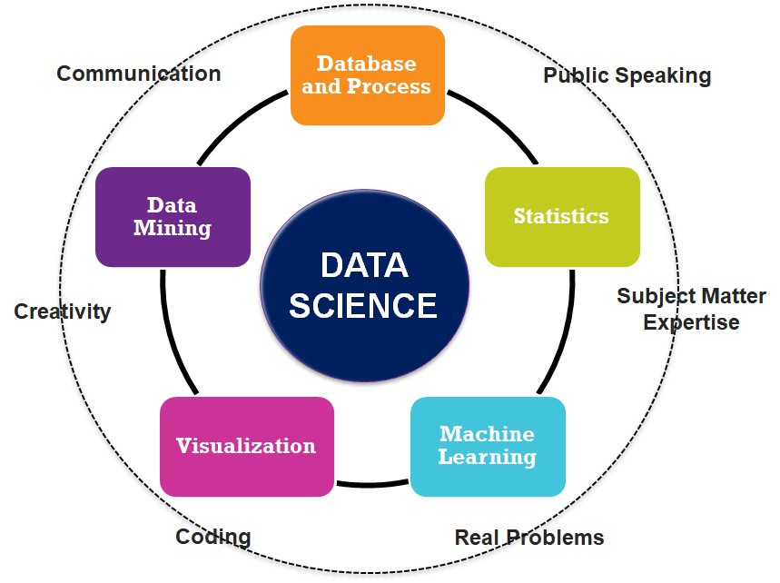

```{r setup, include=FALSE}
knitr::opts_chunk$set(echo = TRUE)
```

**Question 3:**
One job that I think is related to data science is a **Data Scientist**. Data science itselfs involves a lot *statistics*, *data analysis*, *machine learning*, and more. Data scientists use these types of methods in their field to solve real world problems and in order to understand and analyze the meaning of the data they are working with. To learn more about a data scientist check out this website: <https://www.sas.com/en_us/insights/analytics/what-is-a-data-scientist.html>
    
## {.white}




**Question 4:**
```{r}
version
```

**Question 5:**

    -macOS operating system nothing to be installed based on what the hw1 tutorial says

**Question 6**

    -Output:
    (base) Sonias-MacBook-Pro-2:~ sonia$ git --version
    git version 2.20.1 (Apple Git-117)

**Question 7**

    -Output:
    (base) soniascomputer:~ sonia$ git config --global  user.email "sthomas8@iastate.edu"
    (base) soniascomputer:~ sonia$ git config --global  user.name "Sonia Thomas"(base) soniascomputer:~ sonia$
    
**Question 8**
 
    -GitHub Username: sthomas20

